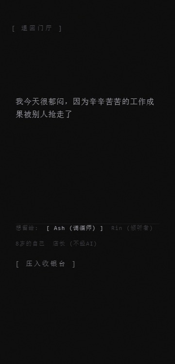
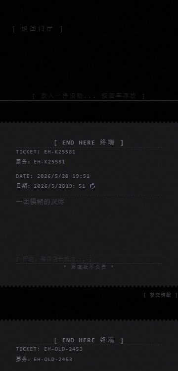

# End Here

> A private observatory for tracking how thoughts and life gradually change over time.

### Home

### Speaking

### Receipt

End Here is an open-source experiment in emotional reflection, personal state observation, and privacy-first digital wellbeing.

Most digital products are designed to maximize engagement, interaction, and feedback loops.

End Here explores a different question:

**What if technology could help people observe change instead of constantly reacting to it?**

The project provides a space where emotions can be expressed, life fragments can be recorded, and long-term personal patterns can be observed without scores, streaks, rankings, or growth metrics.

---

## Core Principles

### Emotion as Entrance, Life as Evidence

End Here uses a dual-track system:

* **Mind Track** — evolving viewpoints, beliefs, and reflections.
* **Life Track** — small daily actions, routines, and life fragments.

Together they create a longitudinal record of personal state changes over time.

---

### Zero-Judgment Policy

End Here does not evaluate people.

The system does not use:

* emotional scores
* growth levels
* check-in streaks
* point systems
* productivity metrics

Instead of saying:

> "You have grown."

The system only presents observable changes across time.

---

### Privacy First

Personal stories, names, and sensitive details remain local.

Only abstracted patterns and state information may be stored in the cloud.

The goal is to preserve reflection while minimizing unnecessary exposure of personal information.

---

### Observe, Don't Optimize

End Here is not designed to maximize productivity.

It is not a self-improvement system.

It is not a performance tracker.

Its purpose is to provide a quiet space for observing how a person changes through time.

---

## Architecture

The system is built around:

* SPA-first interaction architecture
* State-machine driven navigation
* Mind Track / Life Track extraction
* Privacy-preserving data separation
* Lazy evaluation of world traces
* LLM-powered reflective dialogue

Detailed architecture documentation can be found in:

* `02_ARCHITECTURE.md`

---

## Documentation

* Product Strategy → `01_PRODUCT_STRATEGY.md`
* Architecture → `02_ARCHITECTURE.md`
* Changelog → `03_CHANGELOG.md`

---

## Roadmap

Current focus:

* Dual-Track System
* Reflection Archive
* Privacy Infrastructure
* Longitudinal State Observation

---

## Contributing

Contributions, discussions, and ideas are welcome.

Please see `CONTRIBUTING.md` for contribution guidelines.

---

## License

MIT License
